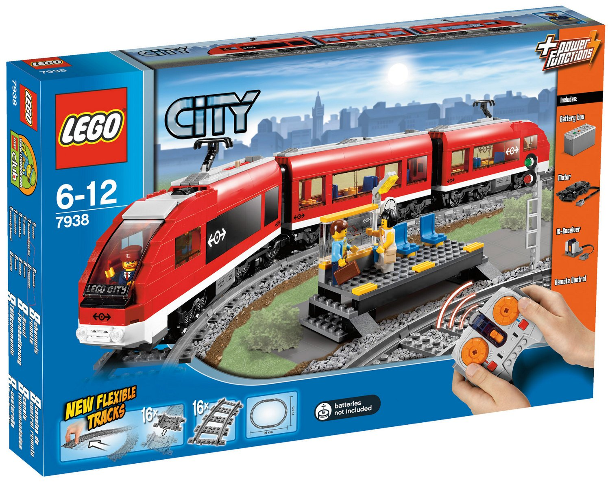
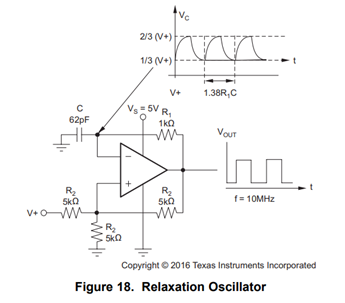
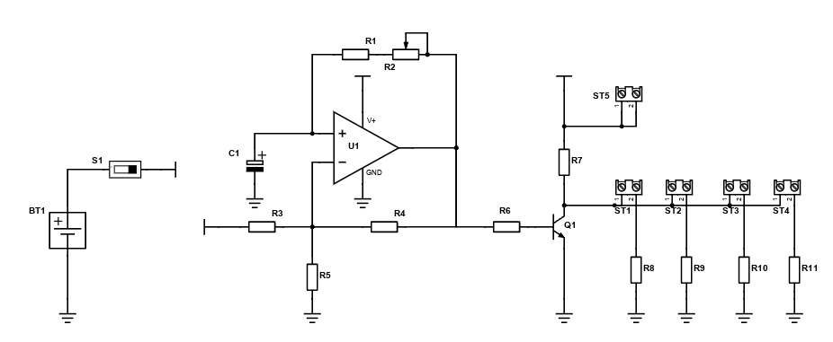

# Simple Flashing LED controller for LEGO train

## Purpose
I own LEGO set number #7938, motorized modern passanger train and wanted to add festive lighting to its passanger compartments.

This is how the train looks from the outside, spot the clear lack of wintery decorations:

 
  

    
     
     
    <a><b>Two-peak current source input-output characteristic</b></a>

 

In order to achieve my stated goals I designed, assembled and tested a simple control board on perfoboard in the two days before Christmas.

## A bit of circuit theory
The circuit I built to control several low power 5mm LEDs is designed around an RC relaxation oscillator. The oscillator should normally be built using a comparator, but such a component was not available in my pile of random components.

This is how the oscillator looks like:

 
  

    
     
     
    <a><b>Relaxation oscillator</b></a>

 

The oscillator produces a square wave signal with frequency determined by the series RC network formed by R1 and C, according to the formula $f_{osc} = \frac{1}{1.38 \cdot R_{1}\cdot C}$. A proper derivation of the timing formula is provided <a href="https://www.ti.com/lit/ab/snoa998/snoa998.pdf?ts=1704275294118&ref_url=https%253A%252F%252Fwww.google.ru%252F">here .</a>

This circuit is useful at both higher and lower frequencies. For my uses a 50K potentiometer and a 10uF capacitor sufficed.

This is how the control boards look like at component level:

 
  

    
     
     
    <a><b>Implemented led control board</b></a>

 

The for screw terminals ST1 to ST4 are used to control colored leds placed in different corners of the train wagon. To connect the LEDs to the control board I used male to female Dupont cables. ST5 provides access to the positive rail of the circuit to increase the number and 
brightness of controllable LEDs.

The circuit has a small problem with current sharing, output current is controlled by R7 and is therefore quite small. With more LEDs the current driving each led decreases and the brightness is also reduced.
## Some preliminary conclusions
The design is a very capable low frequency flasher, but more attention should be paid to:
- Using JST cable or ribbon connector to link the leds to the control board
- Minimising accidental contact to the inverting terminal of the op amp
- Better placement of overall power switch
- Regulating the positive voltage rail to a stable and manageable value
- Batteries with bigger capacity and smaller voltage should be used, 9V batteries have too low of a capacity
- Better current sharing for the leds
## Bibliography
